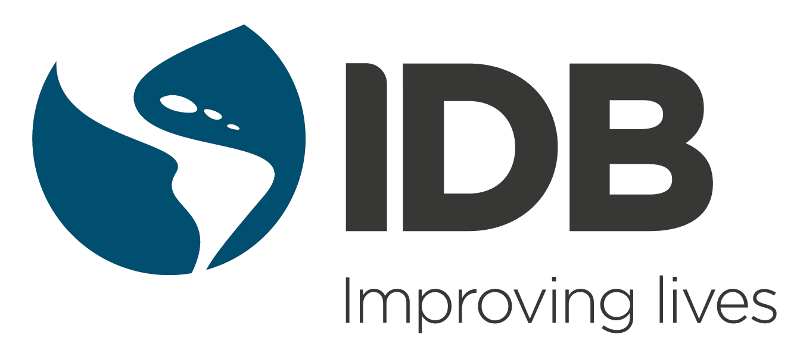

```{=html}
<style type="text/css">
h1 { /* Header 1 */
  font-size: 24px;
  margin-bottom: 0px;
}
h2 { /* Header 2 */
    font-size: 19px;
    margin-bottom: 0px;
     margin-top: 0px;
}
h3 { /* Header 3 */
    font-size: 20px;
    margin-bottom: 15px;
}
body {
text-align: justify}

</style>
```
```{r setup, include=FALSE}
knitr::opts_chunk$set(echo = TRUE) 
```

# Overview {.unnumbered}

```{r IDB, out.width='45%', fig.align='left', echo=FALSE, include=identical(knitr:::pandoc_to(), 'html'), fig.link='https://www.iadb.org/en/sharing-knowledge/data/social-data', fig.show='hold',  out.extra='style="float:right; padding:0px"'}

```

[**Data and Indicators for Latin America and the Caribbean (LAC)**](https://www.iadb.org/en/sharing-knowledge/data/social-data) is a digital platform that provides key data and indicators for regional research and development. It addresses fundamental issues such as poverty, health, inequality, employment, education, and migration and especially highlights the gender and diversity perspective.

The purpose of this tool is to provide a unified source of harmonized, standardized, and comparable demographic, economic, and social data for the 26 countries of the LAC region. The goal is to invite diverse audiences to discover and study the situation in the region.

This document outlines the methodology used to estimate and present data and indicators on the platform. Links to the methodology in English, Spanish, and Portuguese are available below:[^1]

[^1]: This report is written with the `Markdown` [@markdown] and the `bookdown` [@bookdown] packages.

-   [**English**](#intro-eng)

-   [**Spanish**](#intro-esp)

-   [**Portuguese**](#intro-pt)

**To cite the platform, please use:** Inter-American Development Bank -IDB (2023). "Data and Indicators of Latin America and the Caribbean." Available in <https://www.iadb.org/en/sharing-knowledge/data/social-data>. Accessed 2023."

## Limitation of responsibilities {.unnumbered}

The IDB is not responsible, under any circumstance, for damage or compensation, moral or patrimonial; direct or indirect; accessory or special; or by way of consequence, foreseen or unforeseen, that could arise:

I. Under any concept of intellectual property, negligence or detriment of another part theory; I ii. Following the use of the Digital Tool, including, but not limited to defects in the Digital Tool, or the loss or inaccuracy of data of any kind. The foregoing includes expenses or damages associated with communication failures and / or malfunctions of computers, linked to the use of the Digital Tool.
